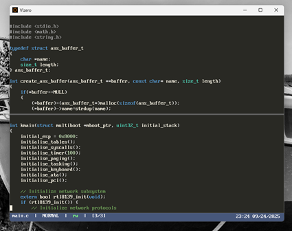

# Vizero



A modern vi clone built with SDL2 and OpenGL, featuring hardware-accelerated rendering, comprehensive search and replace capabilities, multi-buffer and multi-window support, and integrated compiler tools.

## Recent Improvements (2025)

- **Word Wrap (linewrap) by Default**: Lines wrap at word boundaries, with hanging indent for wrapped lines. Toggle with `:set linewrap on|off`.
- **Markdown Syntax Highlighting**: Built-in Markdown highlighting with improved colour contrast for headings, code, and emphasis.
- **Status Bar Improvements**: Status bar now features a right-aligned time/date panel, auto-reverting status messages, and clear error/info popups.
- **Robust Cursor and Scrolling**: Cursor always visible, including on empty lines. Vertical scrolling and cursor movement are robust, with preferred column logic for up/down and correct mapping between logical and visual cursor positions.
- **Window Focus and Input Routing**: All input and editing operations always follow the currently focused window, matching vi-like behavior. After any window focus change (e.g., `Ctrl+w`), all input goes to the correct window and buffer.
- **Crash/Corruption Fixes**: Resolved all known crashes and data corruption after split and file load operations. Buffer and window arrays are always in sync.
- **Merged Rendering Logic**: Word wrap, syntax highlighting, and cursor/scrolling are now unified in the renderer for consistent behavior.
- **Settings System**: All settings (including word wrap, line numbers, etc.) are persistent and saved to `%APPDATA%\Vizero\settings.ini`.
- **Build Warnings Eliminated**: All known build warnings have been resolved. The build is clean on MSVC, GCC, and Clang.

## September 2025 Update: Major Features and Fixes

- **Complete Buffer Management System**: Fixed buffer duplication issues, proper `:bn`/`:bp` navigation, and added direct buffer switching with `:b1`, `:b2`, etc.
- **Interactive Buffer Selector**: `:buffers` now opens a visual buffer browser with arrow key navigation and Enter to switch buffers.
- **Insert Mode Cursor**: Insert mode now shows traditional underline cursor instead of block cursor for better vi compatibility.
- **Logo Display**: Vizero logo appears on startup when no files are loaded, creating a professional welcome screen.
- **Search System Improvements**: Fixed double-character input issues in search mode (`/`, `?`) and command mode (`:`).
- **Colour Theme System**: Complete theming with Default, Monokai, and Solarized Dark themes. Switch themes with `:colourscheme <theme>` command.
- **Session Management Infrastructure**: Added comprehensive session management system with `:mksession`, `:session`, `:sessions`, and `:session-save` commands (implementation in progress).
- **Status Message Timeouts**: Status messages now auto-dismiss after 3 seconds for better user experience.
- **Clean Build System**: Eliminated all compilation warnings for a professional development experience.

## Executables

Vizero provides two Windows executables:

- **`vizero.exe`**: Console version with command-line output and debugging information
- **`vizero-gui.exe`**: GUI version without console window for cleaner desktop integration

Both versions share identical functionality and command-line arguments. Use the GUI version for regular editing and the console version for debugging or when you need to see command-line output.

## Usage Notes

For more details, see `manual.md` and `docs/DEVELOPMENT.md`.
- **Window focus and input routing**: All input and editing operations now follow the currently focused window, matching vi-like behavior. After using `Ctrl+w` or any window focus command, keypresses and text input go to the correct window.
- **Crash/corruption fixes**: Resolved crashes and data corruption after split and file load operations.
- **Helper functions for window manager**: All access to window manager internals is now via safe helper functions, improving code safety and maintainability.

## Features

### [*] Complete Vi Editing Experience
- **Modal Editing**: Normal, Insert, Visual, and Command modes
- **Vi Navigation**: hjkl movement, word jumping, page navigation
- **Search & Replace**: Full regex support with visual highlighting
- **Multi-Buffer Support**: Work with up to 128 files simultaneously
- **Advanced Cursor Operations**: Word boundaries, line start/end navigation
- **Complete Undo System**: 1000-operation undo history per buffer

### [*] Modern Interface
- **Hardware Acceleration**: SDL2/OpenGL rendering at 60fps
- **Visual Search Highlighting**: Current match in orange, others in yellow
- **Responsive UI**: Smooth scrolling and real-time feedback
- **Fullscreen Support**: F11 toggle with seamless scaling
- **Smart Popup System**: Auto-dismissing status and error messages

### [*] File & Buffer Management
- **Multi-Buffer Navigation**: `:bn`, `:bp`, `:b1`, `:b2`, etc.
- **Cross-Platform File Handling**: Automatic line ending normalization
- **File Reading**: `:r filename` inserts files at cursor position
 - **Smart Buffer Switching**: Detects already-open files
 - **Multi-Window Support**: Split windows, focus any window, and input always follows the focused window (vi-style `Ctrl+w` navigation)

### [*] Developer Tools
- **Compiler Integration**: Built-in C/C++/Assembly compilation
- **Plugin System**: Dynamic syntax highlighting and extensions
- **Settings Persistence**: Configuration saved to `%APPDATA%\Vizero\`
- **Command Execution**: Direct compiler invocation from editor

### [*] Standard Features
- **Clipboard Integration**: Full Ctrl+C/X/V system clipboard support
- **Smart Indentation**: Context-aware tab handling (4 spaces)
- **Line Numbers**: Toggle with `:linenum on/off`
- **Selection Support**: Visual mode with Shift+Arrow keys

## Quick Start

### Installation
```bash
# Build from source
mkdir build && cd build
cmake ..
cmake --build . --config Release
```

### Basic Usage
```bash
# Open a single file
./vizero filename.c

# Open multiple files
./vizero file1.c file2.h data.txt
```

### Essential Commands

#### File Operations
```
:e filename    # Open file in new buffer
:w             # Save current buffer  
:wa            # Save all buffers
:q             # Quit (warns if unsaved)
:q!            # Force quit (discard changes)
:wq, :x        # Save and quit
:r filename    # Read file at cursor
:file          # Show filename and status
:n, :next      # Edit next file (same as :bn)
:prev          # Edit previous file (same as :bp)
:pwd           # Print working directory
```

#### Buffer Management  
```
:buffers       # Interactive buffer selector (arrows + Enter)
:bn            # Next buffer
:bp            # Previous buffer  
:b1, :b2, :b3  # Jump to buffer number
:bd            # Delete current buffer
:bd N          # Delete buffer N
:new           # Create new empty buffer
:enew          # Create new unnamed buffer
```

#### Window Management
```
:split, :sp    # Split horizontally
:vsplit, :vsp  # Split vertically
:close, :clo   # Close current window
:only          # Close all windows except current
```

#### Navigation
```
gg             # Go to first line
G              # Go to last line
:42            # Go to line 42
:$             # Go to last line
```

#### Search & Replace
```
/pattern       # Search forward (with highlighting)
?pattern       # Search backward
n              # Next match
N              # Previous match
:s/old/new/    # Replace on current line
:%s/old/new/g  # Replace all in file
```

#### Advanced Line Operations
```
:5d            # Delete line 5
:10y           # Yank (copy) line 10
:1,5d          # Delete lines 1-5
:1,5y          # Yank (copy) lines 1-5
:1,5s/old/new/g# Substitute in line range
:.,+3d         # Delete current line + 3 more
:g/pattern/d   # Delete all lines matching pattern
:g/pattern/p   # Show all lines matching pattern
:v/pattern/d   # Delete lines NOT matching pattern
```

#### Marks & Navigation
```
:marks         # Show marks information
:jumps         # Show jump history information  
:changes       # Show change history information
```

#### External Commands
```
:!command      # Execute shell command in new window
:r !command    # Read command output into buffer
```

#### Directory & File Operations
```
:ls            # List files in directory
:chdir <path>  # Change working directory
```

#### Compilation & Execution
```
:cc main.c -o program.exe    # Compile C
:cpp main.cpp -o program.exe # Compile C++
:asm code.asm -o code.o      # Assemble
:result        # Show compilation result
:run program   # Run program in new window
:run           # Run last compiled executable
:make          # Run make command in new window
```

#### Settings & Configuration
```
:set linewrap on/off    # Toggle word wrap
:linenum on/off         # Toggle line numbers
:syntax on/off          # Toggle syntax highlighting
:tabs 4                 # Set tab size
:show                   # Show all settings
:help                   # Show comprehensive help
:version                # Show version information
:colourscheme <theme>   # Switch colour theme (Default/Monokai/Solarized Dark)
```

#### Compiler Configuration
```
:set c_compiler gcc|msvc        # Set C compiler
:set cpp_compiler g++|msvc      # Set C++ compiler  
:set assembler nasm|fasm        # Set assembler
:set c_compiler_path <path>     # Set C compiler path
:set cpp_compiler_path <path>   # Set C++ compiler path
:set assembler_path <path>      # Set assembler path
:show c_compiler                # Show current C compiler
```

#### Session Management
```
:mksession <name>       # Create/save session
:session <name>         # Load session
:sessions               # List available sessions
:session-save           # Save current session
```

## Advanced Features

### Buffer Workflow Example
```bash
# Start with main file
vizero main.c

# Open related files
:e header.h
:e utils.c
:e data.txt

# Navigate between buffers
:buffers               # Interactive buffer selector (use arrows + Enter)
:b1                    # Jump to main.c
:bn                    # Next buffer (header.h)
:bp                    # Previous buffer (main.c)
```

### Search & Replace Examples
```bash
# Find all functions
/function.*\(

# Replace printf with cout globally
:%s/printf/cout/g

# Case-sensitive word search
/\bTODO\b
```

### Plugin Development
```c
#include "vizero/plugin_interface.h"

VIZERO_PLUGIN_DEFINE_INFO(
    "Custom Highlighter",
    "1.0.0",
    "Your Name", 
    "Syntax highlighting for custom language",
    VIZERO_PLUGIN_TYPE_SYNTAX_HIGHLIGHTER
);

static int highlight_syntax(/* ... */) {
    // Implement syntax highlighting
    return 0;
}
```

## Architecture

- **Core**: SDL2 window management and OpenGL rendering
- **Text Engine**: Efficient multi-buffer line management  
- **Editor**: Vi-compatible mode system and command processing
- **Search**: C++ regex engine with visual feedback
- **Plugins**: Dynamic loading system with C API
- **Settings**: INI-based persistent configuration

## Requirements

### Build Dependencies
- SDL2 development libraries
- OpenGL/GLEW  
- CMake 3.10+
- C/C++ compiler (MSVC, GCC, or Clang)
- Boost libraries (system, filesystem)

### Runtime
- Modern GPU with OpenGL 3.3+ support
- 50MB RAM minimum
- Any modern Windows/Linux system

## Keyboard Reference

### Normal Mode
| Key | Action |
|-----|--------|
| `hjkl` | Vi-style movement |
| `Arrow Keys` | Standard movement |  
| `w/b` | Word forward/backward |
| `0/$` | Line start/end |
| `Page Up/Down` | Page navigation |
| `i` | Enter Insert Mode |
| `o` | Open line below and enter Insert Mode |
| `O` | Open line above and enter Insert Mode |
| `/` | Search forward |
| `n/N` | Next/previous search result |
| `:` | Enter Command Mode |

### Command Mode
| Command | Action |
|---------|--------|
| `:e file` | Open file |
| `:w` | Save current buffer |
| `:wa` | Save all buffers |
| `:q` | Quit |
| `:q!` | Force quit |
| `:wq, :x` | Save and quit |
| `:bn/:bp` | Next/previous buffer |
| `:b[N]` | Switch to buffer N |
| `:bd` | Delete current buffer |
| `:buffers` | Interactive buffer selector |
| `:ls` | List files in directory |
| `:new` | New empty buffer |
| `:split/:vsplit` | Split window |
| `:close` | Close window |
| `:only` | Close all except current window |
| `:enew` | Edit new unnamed buffer |
| `:[N]` | Go to line N |
| `:cc/:cpp/:asm` | Compile files |
| `:run` | Execute program |
| `:make` | Run make command |
| `:!cmd` | Execute shell command |
| `:r !cmd` | Read command output |
| `:set` | Configure settings |
| `:help` | Show help |
| `:version` | Show version info |
| `:colourscheme <theme>` | Switch colour theme |
| `:mksession <name>` | Create session |
| `:session <name>` | Load session |
| `:sessions` | List sessions |
| `:d/:y/:p/:P` | Delete/yank/paste lines |
| `:j` | Join lines |
| `:u/:redo` | Undo/redo |
| `g/<pattern>/d` | Global delete |
| `v/<pattern>/d` | Inverse global delete |

## Contributing

Areas for contribution:
- Additional language plugins
- Vi command implementations  
- Performance optimizations
- Cross-platform testing
- Documentation improvements

## Troubleshooting

- **Input not following window focus?** This is now fixed: after any window focus change, all input and editing will go to the correct (focused) window.
- **Crashes after split or file load?** These have been resolved with robust buffer/cursor management.

## License

MIT License - see LICENSE file for details.
